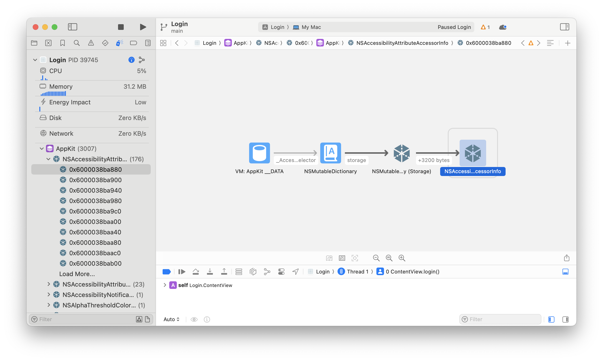
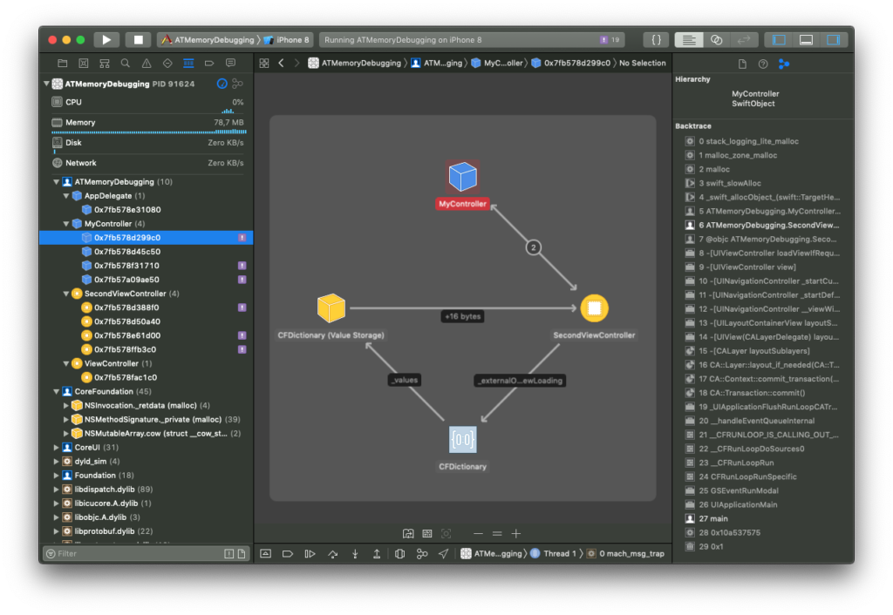

# Cognizant Interview Questions

## Q: If there is a List in SwiftUI with a memory leak, how do you detect it?

**Answer:**

### Detection Tools

**1. Xcode Memory Graph Debugger** — most common answer
- Run the app, click the **Memory Graph** button in the debug bar



- Look for objects that should have been deallocated — purple `!` icons indicate leaked objects
- Inspect retain cycles between view models, closures, or data sources



**2. Instruments — Leaks Tool** — most powerful
- Profile via **Product > Profile > Leaks**
- Scroll the `List` repeatedly, watch for **red bars** in the Leaks track
- Shows exactly which object is leaking and the retain cycle

**3. Instruments — Allocations Tool**
- Enable **Generation Analysis**, take heap snapshots before/after interacting with the `List`
- Compare generations to find objects that persist when they shouldn't

**4. `deinit` Logging** — quick check during development
```swift
class NoteViewModel: ObservableObject {
    deinit {
        print("NoteViewModel deallocated")
        // if this never prints — you have a leak!
    }
}
```
If `deinit` never fires after navigating away, there is a retain cycle.

---

### Common Causes

**Strong capture of `self` in closures:**
```swift
// Bad — strong reference, causes leak
onUpdate = { self.update() }

// Good — use [weak self]
onUpdate = { [weak self] in self?.update() }
```

**Timer not invalidated:**
```swift
// Bad — strong capture + no invalidation, causes leak
class ViewModel: ObservableObject {
    var timer: Timer?

    init() {
        timer = Timer.scheduledTimer(withTimeInterval: 1, repeats: true) { _ in
            self.update() // strong capture of self
        }
    }
}

// Good — [weak self] + invalidate in deinit
class ViewModel: ObservableObject {
    var timer: Timer?

    init() {
        timer = Timer.scheduledTimer(withTimeInterval: 1, repeats: true) { [weak self] _ in
            self?.update()
        }
    }

    deinit {
        timer?.invalidate()
    }
}
```

**Other causes:** storing `AnyCancellable` outside the object's lifecycle, circular references between parent and child view models.

---

### Interview Summary

| Tool | Best for |
|---|---|
| Memory Graph Debugger | Quick visual check |
| Instruments Leaks | Deep investigation |
| `deinit` print | During development |

**3-step answer:** Detect with Memory Graph or Instruments → Confirm with `deinit` → Fix with `[weak self]`, invalidate timers, break retain cycles.
